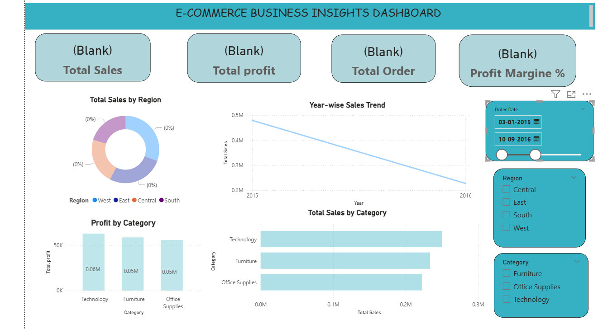
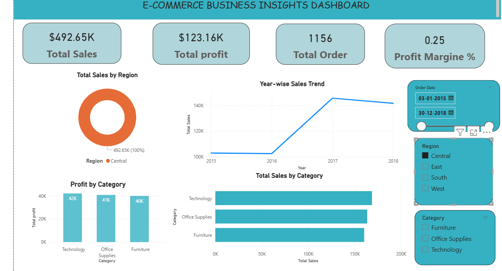

# 📊 E-Commerce Business Insights Dashboard

An interactive Power BI dashboard that provides detailed insights into e-commerce sales performance, profitability, and regional trends. This project demonstrates data visualization, business intelligence, and analytical skills using Power BI.

-------------------------------------------------

## 🚀 Project Overview
This dashboard converts raw e-commerce sales data into meaningful visual insights. It helps businesses monitor performance, identify trends, and make data-driven decisions through interactive charts and filters.

-------------------------------------------------

## 🎯 Objectives
- Analyze total sales, profit, and orders
- Identify top-performing regions and categories
- Track yearly sales trends
- Compare category-wise performance
- Provide interactive filtering for analysis

--------------------------------------------------

## 🛠 Tools & Technologies Used
- Power BI Desktop
- DAX (Data Analysis Expressions)
- Power Query
- Excel / CSV Dataset

-------------------------------------------------

## 📈 Dashboard Features
- KPI Cards (Sales, Profit, Orders, Profit Margin)
- Sales by Region (Donut Chart)
- Year-wise Sales Trend (Line Chart)
- Profit by Category (Column Chart)
- Total Sales by Category (Bar Chart)
- Interactive Filters (Date, Region, Category)

------------------------------------------------

## 📷 Dashboard Preview

### Main Dashboard

### Chart Interactions

### Sales Trend

### Regional Analysis

--------------------------------------------

## 📊 Insights Derived
- Technology category generates highest profit
- Sales increased significantly after 2016
- West region contributes highest revenue share
- Business shows stable profit margin performance

----------------------------------------

## 📌 How to Use
1. Download the `.pbix` file
2. Open in Power BI Desktop
3. Interact with filters and visuals

----------------------------------------

## 📎 Project Files Included
- Dashboard PBIX file
- Dataset (CSV)
- Project Report
- Dashboard Screenshots

---------------------------------------

## 👨‍💻 Author
**Ayush Kumar**

---

 If you like this project, consider giving it a star!
